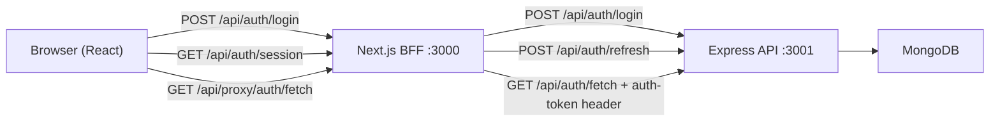
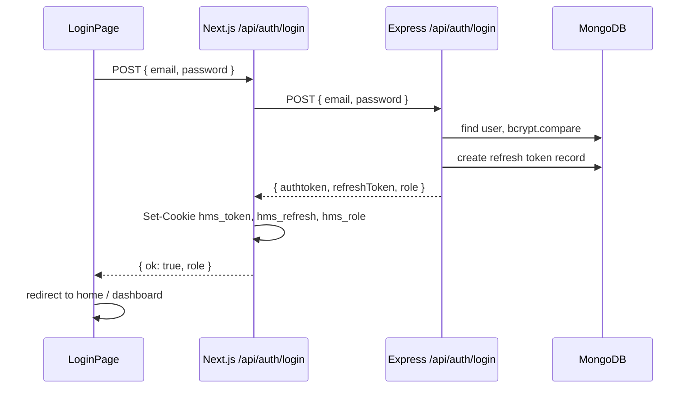
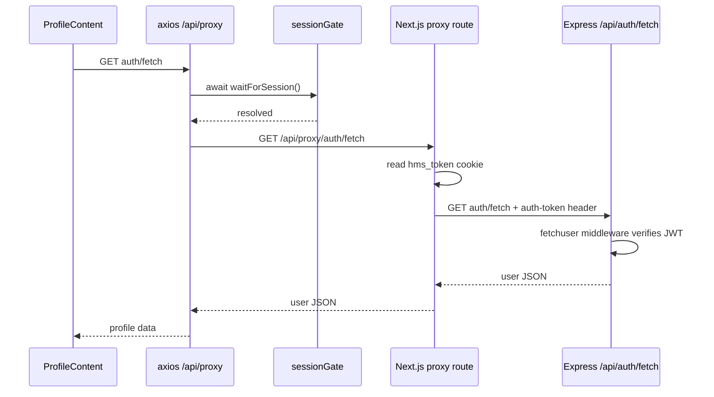
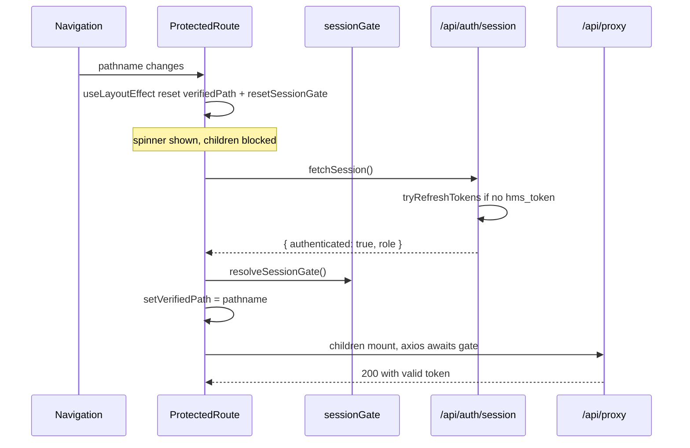
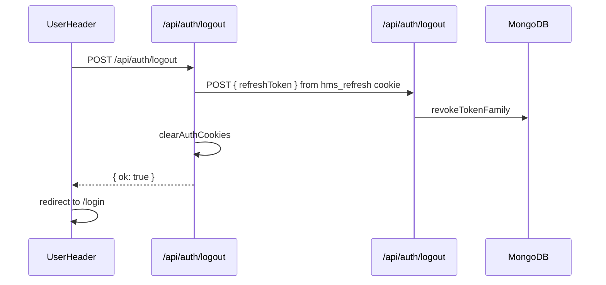

# Hospital Management System — Authentication Guide

Interview reference for the full auth stack: **Express backend (port 3001)** + **Next.js BFF frontend (port 3000)**.

---

## 1. Overview

### What we built

A **Backend-for-Frontend (BFF)** auth pattern:

- The browser **never stores JWTs in JavaScript** (no `localStorage`, no `js-cookie`).
- Next.js API routes set **HttpOnly cookies** after login/refresh.
- All backend API calls go through **`/api/proxy`** on the Next.js server, which reads cookies and forwards the token as an `auth-token` header.
- **Short-lived access token** (15 min) + **long-lived refresh token** (7 days) with **rotation** and **reuse detection**.

### Why this is industry-standard

| Choice | Reason |
|--------|--------|
| HttpOnly cookies | JS cannot read tokens → mitigates XSS token theft |
| BFF / proxy layer | Tokens stay server-side; frontend only talks to same-origin Next.js |
| Access + refresh split | Short exposure window for access JWT; refresh stored hashed in DB |
| Token rotation | Each refresh issues a new refresh token; old one revoked |
| Reuse detection | If a revoked refresh token is used again → revoke entire token family (stolen token scenario) |

---

## 2. Architecture



**Ports:** Browser sees only `localhost:3000`. Backend runs on `3001` via `NEXT_PUBLIC_API_URL`.

---

## 3. Cookies

Defined in `src/lib/auth/cookies.ts`:

| Cookie | Purpose | Lifetime |
|--------|---------|----------|
| `hms_token` | JWT access token | 15 minutes |
| `hms_refresh` | Opaque refresh token | 7 days |
| `hms_role` | User role (`user` / `admin`) | 7 days |

**Flags:** `httpOnly: true`, `sameSite: 'lax'`, `secure: true` in production, `path: '/'`.

---

## 4. Backend Implementation (Express)

**Location:** `E:\new hospital-management\Backend`

### Step 1 — Access token utilities (`utils/tokens.js`)

- `signAccessToken(userId)` — JWT signed with `JWT_SECRET`, expires in `15m`.
- `generateRefreshToken()` — 64-byte random hex string.
- `hashRefreshToken(token)` — SHA-256 hash before storing in DB.
- `getRefreshExpiryDate()` — 7 days from now.

### Step 2 — Refresh token model (`models/refreshToken.js`)

MongoDB schema fields:

- `userId` — reference to User
- `tokenHash` — hashed refresh token (never store plain token)
- `familyId` — UUID grouping tokens from same login session
- `expiresAt` — TTL index for auto-cleanup
- `revokedAt` — null until rotated or revoked

### Step 3 — Refresh token service (`utils/refreshTokenService.js`)

| Function | What it does |
|----------|--------------|
| `createRefreshTokenForUser(userId)` | Creates new token + new `familyId` on login/signup |
| `refreshTokens(refreshToken)` | Validates hash, checks expiry/revocation, rotates token, returns new access + refresh JWT |
| `rotateRefreshToken(storedToken)` | Marks old token revoked, creates new token in same family |
| `revokeTokenFamily(familyId)` | Revokes all tokens in family (triggered on reuse detection) |
| `revokeRefreshToken(refreshToken)` | Called on logout |

**Reuse detection:** If a refresh token with `revokedAt` set is presented again → attacker may have stolen it → revoke entire `familyId`.

### Step 4 — Auth routes (`routes/auth.js`)

| Route | Method | Auth | Returns |
|-------|--------|------|---------|
| `/api/auth/createuser` | POST | No | `authtoken`, `refreshToken`, `role` |
| `/api/auth/login` | POST | No | `authtoken`, `refreshToken`, `role` |
| `/api/auth/refresh` | POST | No | `authtoken`, `refreshToken` (rotated) |
| `/api/auth/logout` | POST | No | Revokes refresh token family |
| `/api/auth/fetch` | GET | Yes | User profile (no password) |
| `/api/auth/update/:id` | PATCH | No* | Updated user |

\* Update route should ideally use `fetchuser` middleware in production.

### Step 5 — Auth middleware (`middleware/fetchuser.js`)

- Reads token from `auth-token` header (or `Authorization: Bearer`).
- Verifies JWT with `jwt.verify`.
- Sets `req.user` for downstream handlers.
- Returns `401` with `token_expired` on expiry.

### Backend login flow (internal)

```
1. Validate email/password with bcrypt.compare
2. signAccessToken(user.id)           → JWT (15m)
3. createRefreshTokenForUser(user.id)  → random token, hash stored in DB
4. Return { authtoken, refreshToken, role } to caller
```

---

## 5. Frontend Implementation (Next.js)

**Location:** `hospital_management_system/src`

### Step 1 — Cookie helpers (`lib/auth/cookies.ts`)

- `setAuthCookies(store, { token, role, refresh })` — sets all three HttpOnly cookies.
- `clearAuthCookies(store)` — deletes all auth cookies on logout/failure.
- `getAuthCookieOptions(maxAge)` — shared cookie security options.

### Step 2 — BFF auth API routes (`app/api/auth/`)

| Route | File | Purpose |
|-------|------|---------|
| `POST /api/auth/login` | `login/route.ts` | Calls backend login → sets HttpOnly cookies → returns `{ ok, role }` |
| `POST /api/auth/logout` | `logout/route.ts` | Revokes refresh on backend → clears cookies |
| `GET /api/auth/session` | `session/route.ts` | Returns `{ authenticated, role }`; auto-refreshes if `hms_token` missing |
| `POST /api/auth/refresh` | `refresh/route.ts` | Explicit refresh endpoint for client/axios retry |

### Step 3 — Token refresh helper (`lib/auth/refresh.ts`)

`tryRefreshTokens(cookieStore)`:

1. Read `hms_refresh` from cookies.
2. `POST` to backend `/api/auth/refresh` with `{ refreshToken }`.
3. On success → `setAuthCookies` with new token + rotated refresh.
4. Returns `true` / `false`.

### Step 4 — API proxy (`app/api/proxy/[...path]/route.ts`)

BFF proxy for all backend calls:

1. Read `hms_token` from cookies.
2. If missing → `tryRefreshTokens()` first.
3. Forward request to backend with `auth-token: <jwt>` header.
4. On `401` → retry once after refresh; if still fails → `clearAuthCookies`.

Client axios base URL is `/api/proxy` (see `services/api.ts`).

### Step 5 — Edge middleware (`middleware.ts`)

Runs before page loads:

- Reads `hms_token`, `hms_refresh`, `hms_role` from request cookies.
- `isAuthenticated = token OR (refresh AND role)` — allows access while access token expired but refresh valid.
- Redirects unauthenticated users from protected routes to `/login?redirect=...`.
- Redirects authenticated users away from `/login` and `/signup`.
- Admin routes require `role === 'admin'`.

### Step 6 — Route config (`conf/routes.config.ts`)

| Type | Routes |
|------|--------|
| Public | `/`, `/details`, `/donation`, `/contact-us`, `/login`, `/signup` |
| Auth required | `/appointment`, `/profile` |
| Admin | `/dashboard`, `/add-doctor`, etc. |
| Auth redirect | `/login`, `/signup` (redirect if already logged in) |

### Step 7 — Client auth layer

| File | Role |
|------|------|
| `utils/auth.ts` | `fetchSession()`, `loginRequest()`, `logoutRequest()`, `refreshSession()` |
| `components/auth/AuthProvider.tsx` | Wraps app; mounts `ProtectedRoute` on guarded pages |
| `components/auth/ProtectedRoute.tsx` | Session check per navigation; provides `AuthSessionContext` |
| `context/AuthSessionContext.tsx` | `{ sessionReady, authenticated, role }` for UI |
| `hooks/useAuthenticatedEffect.ts` | Runs effects only after session is ready |
| `lib/auth/sessionGate.ts` | Promise gate — blocks axios until session completes |
| `lib/auth/refreshLock.ts` | Serializes concurrent server-side refresh calls |
| `components/auth/SessionRefresh.tsx` | Proactive refresh every 14 minutes |
| `services/api.ts` | Axios: request interceptor awaits `waitForSession()`; 401 → refresh retry |

---

## 6. Auth Flows

### 6.1 Login flow



### 6.2 Protected API call flow



### 6.3 Token refresh on navigation (session gate)

**Problem solved:** When access token expires and user navigates (e.g. Appointment → Profile), profile API and session refresh could race → double refresh → token reuse logout.

**Solution:**



### 6.4 Logout flow



### 6.5 Axios 401 retry flow

When a proxy call returns 401 (expired access token mid-session):

1. Axios response interceptor catches 401.
2. `POST /api/auth/refresh` (client-side).
3. If OK → retry original request once (`_retry` flag).
4. If fail → logout + redirect to `/login`.

---

## 7. Race-Condition Fixes

| Mechanism | File | What it prevents |
|-----------|------|------------------|
| `refreshLock.ts` | `lib/auth/refreshLock.ts` | Two server-side refresh calls using same refresh token in parallel |
| `sessionGate.ts` | `lib/auth/sessionGate.ts` | API calls firing before `/api/auth/session` completes |
| `useLayoutEffect` | `ProtectedRoute.tsx` | Children rendering one frame before auth reset on navigation |
| `verifiedPath` state | `ProtectedRoute.tsx` | Page content shown before session verified for current pathname |
| `waitForSession()` | `services/api.ts` | Axios hard-blocks until gate resolves |

---

## 8. Key Files Quick Reference

### Frontend (Next.js)

| File | Purpose |
|------|---------|
| `src/lib/auth/cookies.ts` | Cookie names, set/clear helpers |
| `src/lib/auth/refresh.ts` | Server-side refresh logic |
| `src/lib/auth/refreshLock.ts` | Concurrent refresh deduplication |
| `src/lib/auth/sessionGate.ts` | Promise gate for API ordering |
| `src/app/api/auth/login/route.ts` | Login BFF |
| `src/app/api/auth/logout/route.ts` | Logout BFF |
| `src/app/api/auth/session/route.ts` | Session check + auto-refresh |
| `src/app/api/auth/refresh/route.ts` | Explicit refresh endpoint |
| `src/app/api/proxy/[...path]/route.ts` | Backend API proxy |
| `src/middleware.ts` | Edge route protection |
| `src/utils/auth.ts` | Client auth helpers |
| `src/services/api.ts` | Axios instance + interceptors |
| `src/components/auth/ProtectedRoute.tsx` | Client route guard + session lifecycle |
| `src/components/auth/AuthProvider.tsx` | Top-level auth wrapper |
| `src/conf/routes.config.ts` | Route access rules |

### Backend (Express)

| File | Purpose |
|------|---------|
| `routes/auth.js` | Login, signup, refresh, logout, fetch routes |
| `middleware/fetchuser.js` | JWT verification middleware |
| `utils/tokens.js` | JWT sign, refresh token generation/hashing |
| `utils/refreshTokenService.js` | Rotation, reuse detection, revocation |
| `models/refreshToken.js` | Refresh token MongoDB schema |

---

## 9. How to Build This From Scratch (Checklist)

### Backend

1. Add `jsonwebtoken`, `bcryptjs`, `crypto`.
2. Create `utils/tokens.js` — sign access JWT, generate/hash refresh tokens.
3. Create `models/refreshToken.js` — store hashed refresh tokens with family ID.
4. Create `utils/refreshTokenService.js` — create, rotate, revoke, reuse detection.
5. Add `POST /login` — bcrypt verify → return access + refresh tokens.
6. Add `POST /refresh` — validate refresh → rotate → return new pair.
7. Add `POST /logout` — revoke refresh token family.
8. Add `fetchuser` middleware — verify `auth-token` header on protected routes.

### Frontend

1. Create `lib/auth/cookies.ts` — HttpOnly cookie helpers.
2. Create `POST /api/auth/login` — call backend, set cookies.
3. Create `GET /api/auth/session` — check auth, auto-refresh if needed.
4. Create `POST /api/auth/refresh` and `POST /api/auth/logout`.
5. Create `/api/proxy/[...path]` — read cookie, forward with `auth-token` header.
6. Add `middleware.ts` — protect routes at edge.
7. Point axios to `/api/proxy` with 401 refresh interceptor.
8. Add `ProtectedRoute` + `sessionGate` — session before API on navigation.
9. Configure `NEXT_PUBLIC_API_URL=http://localhost:3001/api/`.

---

## 10. Interview Talking Points

**Q: Why BFF instead of storing JWT in localStorage?**
> localStorage is readable by any JS on the page (XSS risk). HttpOnly cookies are not accessible to JavaScript. The Next.js BFF reads cookies server-side and forwards tokens to the backend — the browser never handles raw JWTs.

**Q: Why access token + refresh token?**
> Access tokens are short-lived (15 min) so a stolen token has limited window. Refresh tokens are long-lived but stored hashed in DB, rotatable, and revocable. This is the standard OAuth2-style session pattern.

**Q: What is refresh token rotation?**
> Every time client refreshes, backend issues a new refresh token and revokes the old one. If the old token is reused, it means possible theft — we revoke the entire token family.

**Q: How do you prevent race conditions on token refresh?**
> Three layers: (1) `refreshLock` deduplicates parallel server refreshes, (2) `sessionGate` promise blocks axios until session route completes, (3) `useLayoutEffect` in ProtectedRoute blocks page render before session check on navigation.

**Q: How does route protection work?**
> Two layers: Edge `middleware.ts` redirects before page load (checks cookies), and client `ProtectedRoute` re-validates session on every navigation via `/api/auth/session`.

**Q: What would you add for production hardening?**
> CSRF tokens on cookie-mutating POST routes, stricter `SameSite=strict`, rate limiting on login/refresh, HTTPS-only cookies, rotate `JWT_SECRET`, add `fetchuser` to all protected backend routes, and auth integration tests.

**Q: What header does the backend expect?**
> `auth-token: <jwt>` (not `Authorization: Bearer`). The Next.js proxy sets this from the HttpOnly cookie.

---

## 11. Environment Variables

| Variable | Where | Purpose |
|----------|-------|---------|
| `NEXT_PUBLIC_API_URL` | Next.js `.env.local` | Backend base URL (`http://localhost:3001/api/`) |
| `JWT_SECRET` | Backend `.env` | JWT signing secret |
| `JWT_ACCESS_EXPIRES` | Backend `.env` | Access token TTL (default `15m`) |
| `JWT_REFRESH_EXPIRES_DAYS` | Backend `.env` | Refresh token TTL (default `7`) |

---

## 12. Manual Test Scenarios

1. **Login** → cookies set → redirect works → protected pages accessible.
2. **Delete `hms_token` only** → navigate to Profile → session refreshes → profile loads (no logout).
3. **Wait 15+ min** → API call → auto refresh via proxy or axios interceptor.
4. **Logout** → all cookies cleared → protected routes redirect to login.
5. **Wrong role** → user cannot access `/dashboard`.
