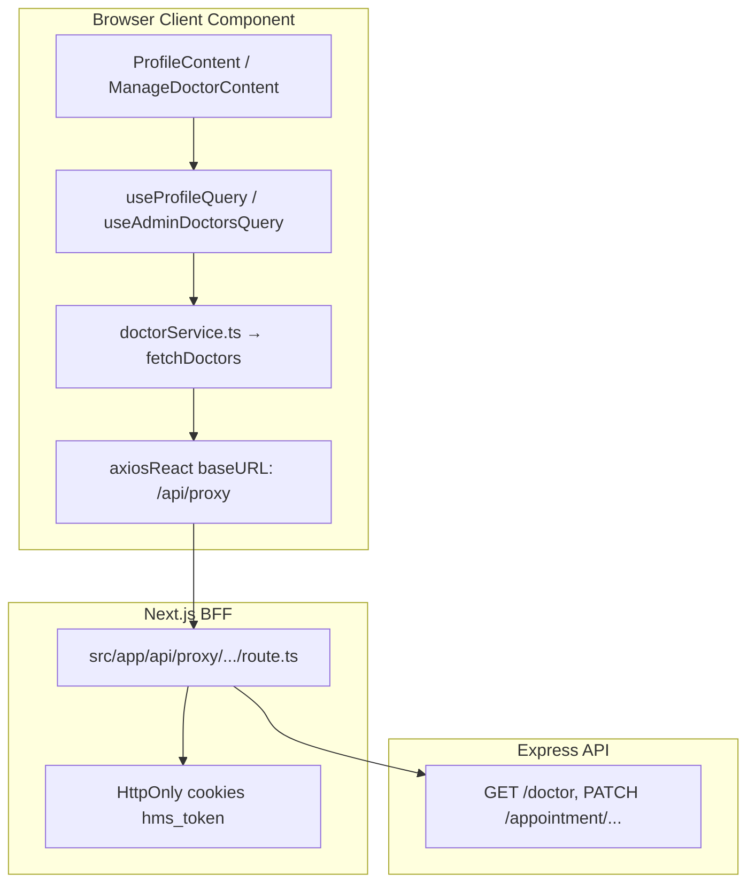
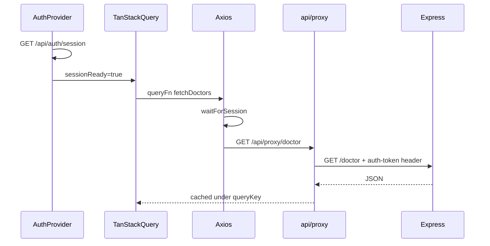

# TanStack Query Guide — Hospital Management System

Step-by-step reference for how **TanStack Query** (React Query) integrates with this Next.js project, how API data flows from the browser to Express, and how to add new endpoints the industry-standard way.

Related docs: [AUTH_SYSTEM.md](./AUTH_SYSTEM.md)

---

## Table of contents

1. [What is TanStack Query?](#1-what-is-tanstack-query)
2. [When to use what in this project](#2-when-to-use-what-in-this-project)
3. [Full API request flow](#3-full-api-request-flow)
4. [Project file map](#4-project-file-map)
5. [Setup: QueryClientProvider](#5-setup-queryclientprovider)
6. [Core concepts](#6-core-concepts)
7. [Step-by-step: add a new API feature](#7-step-by-step-add-a-new-api-feature)
8. [Hook reference (this project)](#8-hook-reference-this-project)
9. [Before vs after migration](#9-before-vs-after-migration)
10. [Common patterns and mistakes](#10-common-patterns-and-mistakes)
11. [Connection to auth (BFF)](#11-connection-to-auth-bff)
12. [Interview cheat sheet](#12-interview-cheat-sheet)

---

## 1. What is TanStack Query?

**TanStack Query** (`@tanstack/react-query`) is a library for managing **server state** on the client — data that comes from an API and lives outside your React component tree.

It handles:

| Concern | What TanStack Query does |
|---------|--------------------------|
| **Fetching** | Calls your API function automatically |
| **Caching** | Stores results so repeat visits are instant |
| **Loading / error** | Gives you `isLoading`, `isError`, `error` |
| **Refetch** | `refetch()` or automatic background updates |
| **Mutations** | POST/PATCH/DELETE with cache invalidation after success |

### What it replaced in this project

**Before:** manual pattern in admin/profile pages:

```tsx
const [data, setData] = useState([]);
const [loading, setLoading] = useState(true);

useEffect(() => {
  const load = async () => {
    setLoading(true);
    try {
      const result = await fetchDoctors();
      setData(result);
    } finally {
      setLoading(false);
    }
  };
  load();
}, [search, page]);
```

**After:** TanStack Query hook:

```tsx
const { data = [], isLoading, refetch } = useAdminDoctorsQuery(search);
```

### What it is NOT

- **Not** a replacement for Next.js **Server Components** or **ISR** on public pages (`/`, `/doctors`)
- **Not** for auth session state (we use **React Context** + cookies)
- **Not** for login/signup (we use direct `fetch` to `/api/auth/*` BFF routes)

---

## 2. When to use what in this project

| Data type | Tool | Example in HMS |
|-----------|------|----------------|
| Public SEO pages | ISR + Server Components | `fetchDoctorsServer()` in `src/lib/server/doctors.ts` |
| Auth session (logged in?) | React Context | `AuthProvider` + `AuthSessionContext` |
| Client API data (authenticated) | **TanStack Query** | Profile, admin dashboard, appointment form |
| Auth mutations (login/signup) | Direct `fetch` to BFF | `loginRequest()` / `signupRequest()` in `src/utils/auth.ts` |
| Route protection | Middleware | `src/middleware.ts` |

**Rule of thumb:**

- Data needed **before** page paint for SEO → Server Component + ISR
- Data needed **after** user logs in, with filters/pagination/mutations → TanStack Query

---

## 3. Full API request flow

When a logged-in user opens `/profile` or `/dashboard`, this is the path a TanStack Query request takes:



### Step-by-step flow

1. **Component** calls `useAdminDoctorsQuery(search)` (must be `'use client'`)
2. **Hook** runs `useQuery` with a `queryKey` and `queryFn: () => fetchDoctors(search)`
3. **Service** (`src/services/doctorService.ts`) calls `axiosReact.get(DOCTORS, { params })`
4. **Axios** (`src/services/api.ts`) waits for session via `waitForSession()`, then sends request to `/api/proxy/doctor/`
5. **Proxy route** reads `hms_token` cookie, forwards request to Express with `auth-token` header
6. **Express** returns JSON → flows back up → TanStack Query caches result under the query key
7. **Component** re-renders with `data`, `isLoading: false`

---

## 4. Project file map

Every layer has one job. Do not skip layers.

| Layer | File | Role |
|-------|------|------|
| **Provider** | `src/app/provider.tsx` | Wraps app in `QueryClientProvider` |
| **Root layout** | `src/app/layout.tsx` | Renders `<Providers>` around children |
| **Query keys** | `src/lib/query-keys.ts` | Unique cache IDs per resource + filters |
| **Hooks** | `src/hooks/queries.ts` | `useQuery` / `useMutation` wrappers |
| **Auth gate** | `src/hooks/useAuthQueryEnabled.ts` | Returns `true` only when session is ready |
| **API client** | `src/services/api.ts` | Axios instance → `/api/proxy`, 401 refresh |
| **URL constants** | `src/services/url.ts` | Backend path strings (`/doctor`, `/appointment/appo`) |
| **Service modules** | `src/services/*.ts` | Pure async functions (fetch, update, delete) |
| **Components** | `src/components/**/*Content.tsx` | UI only — call hooks, never axios directly |

### Layer responsibilities

```
Component     →  "Show loading spinner, render table"
Hook          →  "When to fetch, cache key, invalidate after mutation"
Service       →  "HTTP call + map API shape to app types"
api.ts        →  "Auth cookie proxy, retry on 401"
Express       →  "Business logic + database"
```

---

## 5. Setup: QueryClientProvider

TanStack Query must wrap any component that uses hooks. In this project:

**`src/app/provider.tsx`**

```tsx
'use client';

import { QueryClient, QueryClientProvider } from '@tanstack/react-query';
import { useState } from 'react';

export function Providers({ children }: { children: React.ReactNode }) {
  const [queryClient] = useState(
    () =>
      new QueryClient({
        defaultOptions: {
          queries: {
            staleTime: 30_000,        // Data considered fresh for 30 seconds
            retry: 1,                 // Retry failed requests once
            refetchOnWindowFocus: false, // Don't refetch when user tabs back
          },
        },
      })
  );

  return (
    <QueryClientProvider client={queryClient}>
      {children}
    </QueryClientProvider>
  );
}
```

**`src/app/layout.tsx`** wraps the app:

```tsx
<Providers>
  <AuthProvider>{children}</AuthProvider>
</Providers>
```

### Why `useState(() => new QueryClient())`?

Creating `QueryClient` inside `useState` ensures one instance per browser session and avoids recreating it on every re-render (which would wipe the cache).

---

## 6. Core concepts

### 6a. Query keys — cache identity

File: `src/lib/query-keys.ts`

```ts
export const queryKeys = {
  profile: ['profile'] as const,
  doctors: (search?: string) => ['doctors', search ?? ''] as const,
  adminAppointments: (page, limit, status, search) =>
    ['admin-appointments', page, limit, status, search] as const,
};
```

**Why keys matter:**

- TanStack Query stores data in a cache keyed by this array
- Same key → returns cached data (if not stale)
- Different key → new fetch (e.g. page 2, different search term)
- `invalidateQueries({ queryKey: ['doctors'] })` marks all doctor queries stale and refetches

**Rule:** Include every variable that changes the API response in the key (page, limit, status, search, filters).

---

### 6b. useQuery — READ data

File: `src/hooks/queries.ts`

```ts
export function useAdminDoctorsQuery(search: string) {
  const enabled = useAuthQueryEnabled();
  return useQuery({
    queryKey: queryKeys.doctors(search),
    queryFn: () => fetchDoctors(search),
    enabled,
  });
}
```

| Option | Purpose |
|--------|---------|
| `queryKey` | Cache identifier |
| `queryFn` | Async function that returns data (your service function) |
| `enabled` | If `false`, query does not run (wait for auth, inactive tab) |

**Component usage** (`src/components/admin/ManageDoctorContent.tsx`):

```tsx
const {
  data: doctors = [],
  isLoading: loading,
  isError,
  refetch,
} = useAdminDoctorsQuery(debouncedSearch);

// Render
if (loading) return <Loader />;
if (isError) return <button onClick={() => refetch()}>Retry</button>;
return doctors.map((d) => <DoctorRow key={d.id} doctor={d} />);
```

**Returned fields you'll use most:**

| Field | Meaning |
|-------|---------|
| `data` | API response (undefined while loading) |
| `isLoading` | First fetch in progress |
| `isFetching` | Any fetch in progress (including background) |
| `isError` | Request failed |
| `error` | Error object |
| `refetch()` | Manual retry / refresh button |

---

### 6c. useMutation — WRITE data

File: `src/hooks/queries.ts`

```ts
export function useUpdateDoctorMutation() {
  const queryClient = useQueryClient();
  return useMutation({
    mutationFn: ({ id, payload }: { id: string; payload: UpdateDoctorPayload }) =>
      updateDoctor(id, payload),
    onSuccess: () => {
      queryClient.invalidateQueries({ queryKey: ['doctors'] });
    },
  });
}
```

**Component usage:**

```tsx
const updateDoctorMutation = useUpdateDoctorMutation();

const handleSave = async (id: string, payload: UpdateDoctorPayload) => {
  try {
    await updateDoctorMutation.mutateAsync({ id, payload });
    toast.success('Doctor updated');
  } catch (err) {
    toast.error(parseDoctorError(err));
  }
};
```

| Option | Purpose |
|--------|---------|
| `mutationFn` | Async function that performs the write |
| `onSuccess` | Update cache — usually `invalidateQueries` or `setQueryData` |

**Two ways to update cache after mutation:**

1. **`invalidateQueries`** — mark stale, refetch from server (safest, used in admin lists)
2. **`setQueryData`** — write directly to cache (used in `useUpdateProfileMutation` for instant profile UI)

---

### 6d. enabled + auth gate

File: `src/hooks/useAuthQueryEnabled.ts`

```ts
export function useAuthQueryEnabled() {
  const { sessionReady, authenticated } = useAuthSession();
  return sessionReady && authenticated;
}
```

Authenticated queries use `enabled: useAuthQueryEnabled()` so they **do not fire** until:

1. `AuthProvider` finishes `/api/auth/session`
2. User is logged in

This prevents Axios from hitting `/api/proxy` before cookies/session are ready (see `waitForSession()` in `src/services/api.ts`).

**Tab lazy-loading example** (`useUserMessagesQuery`):

```ts
enabled: useAuthQueryEnabled() && active,  // active = activeTab === 'messages'
```

Messages only fetch when the user opens the Messages tab.

---

### 6e. Service layer — keep HTTP out of components

File: `src/services/doctorService.ts` (pattern used by all services)

```ts
import { axiosReact } from '@/services/api';
import { DOCTORS } from '@/services/url';

export const fetchDoctors = async (search?: string): Promise<Doctor[]> => {
  const params = search?.trim() ? { search: search.trim() } : undefined;
  const { data } = await axiosReact.get<ApiDoctor[]>(DOCTORS, { params });
  return (data ?? []).map(mapApiDoctor);
};
```

Services:

- Call `axiosReact` (never raw `fetch` in components)
- Map API field names (`f_name`, `_id`) to app types (`fullName`, `id`)
- Export pure async functions — no React hooks here

---

## 7. Step-by-step: add a new API feature

Example: **Admin Notifications list** (hypothetical feature). Follow this order every time.

### Step 1 — Backend route exists

Ensure Express has e.g. `GET /notifications` and `PATCH /notifications/:id/read`.

### Step 2 — Add URL constant

File: `src/services/url.ts`

```ts
export const NOTIFICATIONS = '/notifications';
export const NOTIFICATION_READ = (id: string) => `/notifications/${id}/read`;
```

### Step 3 — Create service module

File: `src/services/notificationService.ts`

```ts
import { axiosReact } from '@/services/api';
import { NOTIFICATIONS, NOTIFICATION_READ } from '@/services/url';

export interface Notification {
  id: string;
  title: string;
  read: boolean;
  createdAt: string;
}

export const fetchNotifications = async (): Promise<Notification[]> => {
  const { data } = await axiosReact.get<{ notifications: Notification[] }>(NOTIFICATIONS);
  return data?.notifications ?? [];
};

export const markNotificationRead = async (id: string): Promise<void> => {
  await axiosReact.patch(NOTIFICATION_READ(id), { read: true });
};
```

### Step 4 — Add query keys

File: `src/lib/query-keys.ts`

```ts
notifications: ['notifications'] as const,
```

### Step 5 — Add hooks

File: `src/hooks/queries.ts`

```ts
export function useNotificationsQuery() {
  const enabled = useAuthQueryEnabled();
  return useQuery({
    queryKey: queryKeys.notifications,
    queryFn: fetchNotifications,
    enabled,
  });
}

export function useMarkNotificationReadMutation() {
  const queryClient = useQueryClient();
  return useMutation({
    mutationFn: markNotificationRead,
    onSuccess: () => {
      queryClient.invalidateQueries({ queryKey: queryKeys.notifications });
    },
  });
}
```

### Step 6 — Use in component

File: `src/components/admin/NotificationsContent.tsx`

```tsx
'use client';

import { useNotificationsQuery, useMarkNotificationReadMutation } from '@/hooks/queries';

export default function NotificationsContent() {
  const { data: notifications = [], isLoading, isError, refetch } = useNotificationsQuery();
  const markRead = useMarkNotificationReadMutation();

  if (isLoading) return <p>Loading...</p>;
  if (isError) return <button onClick={() => refetch()}>Retry</button>;

  return (
    <ul>
      {notifications.map((n) => (
        <li key={n.id}>
          {n.title}
          {!n.read && (
            <button onClick={() => markRead.mutateAsync(n.id)}>Mark read</button>
          )}
        </li>
      ))}
    </ul>
  );
}
```

### Step 7 — Wire page

File: `src/app/(admin)/notifications/page.tsx`

```tsx
import NotificationsContent from '@/components/admin/NotificationsContent';

export default function NotificationsPage() {
  return <NotificationsContent />;
}
```

### Checklist

- [ ] URL in `url.ts`
- [ ] Service function(s) in `src/services/`
- [ ] Query key in `query-keys.ts`
- [ ] Hook(s) in `queries.ts`
- [ ] Component uses hook (not axios directly)
- [ ] Mutation invalidates related queries
- [ ] `'use client'` on interactive component
- [ ] `enabled: useAuthQueryEnabled()` if route requires auth

---

## 8. Hook reference (this project)

| Hook | Type | Service | Used in |
|------|------|---------|---------|
| `useProfileQuery` | Query | `fetchUser` | `ProfileContent` |
| `useUpdateProfileMutation` | Mutation | `updateUser` | `ProfileContent` |
| `useUserAppointmentsQuery` | Query | `fetchUserAppointments` | `ProfileContent` |
| `useMessageCountQuery` | Query | `fetchUserMessages` | `ProfileContent` |
| `useUserMessagesQuery` | Query | `fetchUserMessages` | `ProfileContent` |
| `useSendMessageMutation` | Mutation | `sendMessage` | `ProfileContent` |
| `useCancelAppointmentMutation` | Mutation | `cancelAppointment` | `ProfileContent` |
| `useDoctorsQuery` | Query | `fetchDoctors` | `AppointmentForm` |
| `useDashboardStatsQuery` | Query | `fetchDashboardStats` | `DashboardContent` |
| `useAdminDoctorsQuery` | Query | `fetchDoctors` | `ManageDoctorContent` |
| `useUpdateDoctorMutation` | Mutation | `updateDoctor` | `ManageDoctorContent` |
| `useDeleteDoctorMutation` | Mutation | `deleteDoctor` | `ManageDoctorContent` |
| `useAdminUsersQuery` | Query | `fetchAllUsers` | `ManageUserContent` |
| `useDeleteUserMutation` | Mutation | `deleteUser` | `ManageUserContent` |
| `useAdminAppointmentsQuery` | Query | `fetchAdminAppointments` | `ManageAppointmentContent` |
| `useUpdateAppointmentStatusMutation` | Mutation | `updateAppointmentStatusAdmin` | `ManageAppointmentContent` |
| `useAdminContactsQuery` | Query | `fetchAdminContacts` | `ContactMessagesContent` |
| `useUpdateContactReadStatusMutation` | Mutation | `updateContactReadStatus` | `ContactMessagesContent` |
| `useAdminMessagesQuery` | Query | `fetchAdminMessages` | `UserMessagesContent` |
| `useReplyToMessageMutation` | Mutation | `replyToMessage` | `UserMessagesContent` |

---

## 9. Before vs after migration

### Before (manual fetch)

```tsx
const [doctors, setDoctors] = useState<Doctor[]>([]);
const [loading, setLoading] = useState(true);

useEffect(() => {
  let cancelled = false;
  const load = async () => {
    setLoading(true);
    try {
      const data = await fetchDoctors(search);
      if (!cancelled) setDoctors(data);
    } catch {
      if (!cancelled) setError('Failed to load');
    } finally {
      if (!cancelled) setLoading(false);
    }
  };
  load();
  return () => { cancelled = true; };
}, [search]);
```

Problems: boilerplate, no cache, duplicate requests, manual cleanup, easy to forget refetch after mutations.

### After (TanStack Query)

```tsx
const { data: doctors = [], isLoading, isError, refetch } = useAdminDoctorsQuery(search);
const updateMutation = useUpdateDoctorMutation();

const handleSave = async (id, payload) => {
  await updateMutation.mutateAsync({ id, payload });
  // Cache auto-invalidates via onSuccess in hook
};
```

Benefits: less code, shared cache, built-in loading/error, automatic refetch after mutations.

---

## 10. Common patterns and mistakes

### Do

- Put **filters, page, search** in `queryKey`
- Use **`invalidateQueries`** after create/update/delete
- Use **`enabled: false`** until auth or tab is active
- Keep **axios in services**, hooks in `queries.ts`, UI in components
- Show **Retry** with `refetch()` on error
- Debounce search in component, pass **debounced value** to query hook

### Do not

- Call `axiosReact` directly inside components
- Use TanStack Query in **Server Components** (no `'use client'`)
- Forget to invalidate cache after mutations (UI shows stale data)
- Put React hooks inside service files
- Use TanStack Query for **public ISR pages** — use `src/lib/server/fetch.ts` instead

### Debounced search pattern (used in admin tables)

```tsx
const [search, setSearch] = useState('');
const [debouncedSearch, setDebouncedSearch] = useState('');

useEffect(() => {
  const t = setTimeout(() => setDebouncedSearch(search.trim()), 400);
  return () => clearTimeout(t);
}, [search]);

const { data } = useAdminDoctorsQuery(debouncedSearch); // queryKey includes search
```

---

## 11. Connection to auth (BFF)

TanStack Query works **together** with the auth system documented in [AUTH_SYSTEM.md](./AUTH_SYSTEM.md).



Key points:

1. **`AuthProvider`** resolves session first
2. **`useAuthQueryEnabled()`** blocks queries until ready
3. **`axiosReact`** base URL is `/api/proxy` — browser never talks to Express directly
4. **401 responses** trigger token refresh in `src/services/api.ts`, then retry once
5. **Login/signup** bypass TanStack Query — they use `fetch('/api/auth/login')` directly

---

## 12. Interview cheat sheet

### Why TanStack Query instead of Redux for API data?

Redux is for **client UI state** (filters, modals). API data is **server state** — it lives on the backend, goes stale, and needs refetching. TanStack Query is built for caching, deduplication, loading states, and invalidation. Redux adds boilerplate without those features.

### Why not fetch everything in Server Components?

Server Components are great for **public, SEO-friendly** initial data. Authenticated admin/profile data needs cookies, client interactivity (filters, pagination, mutations), and instant updates after edits — that belongs on the client with TanStack Query.

### What is staleTime?

Time (ms) data is considered **fresh**. While fresh, TanStack Query returns cache without refetching. We use `30_000` (30 seconds) in `provider.tsx`.

### What is gcTime (formerly cacheTime)?

How long **unused** data stays in memory after no component uses it. Default is 5 minutes. Different from staleTime.

### How do you refetch after a mutation?

```ts
onSuccess: () => {
  queryClient.invalidateQueries({ queryKey: ['doctors'] });
}
```

Or optimistically: `queryClient.setQueryData(queryKeys.profile, newData)`.

### Can you use TanStack Query on the server?

Not in Server Components. TanStack Query is client-only (`'use client'`). For server data use `fetch` with `next: { revalidate }` in Server Components.

### How does this project structure scale?

New feature = new service file + query keys + hooks + component. Same pattern every time. Easy to test services independently.

---

## Quick reference diagram

```
┌─────────────────────────────────────────────────────────┐
│  Next.js App                                            │
│                                                         │
│  Server Component (public pages)                        │
│    └── serverGet() → Express directly (ISR)             │
│                                                         │
│  Client Component (profile, admin)                      │
│    └── useXxxQuery() → service → axios → /api/proxy     │
│                                                         │
│  Auth (login)                                           │
│    └── fetch('/api/auth/login') → sets cookies          │
└─────────────────────────────────────────────────────────┘
```

---

*Last updated for HMS TanStack Query migration — all admin, profile, and appointment client fetches use this pattern.*
